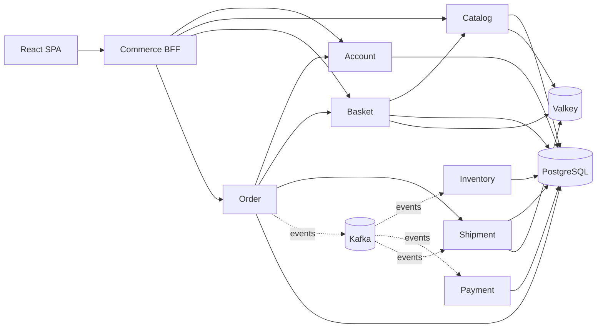

# E-commerce Microservices POC

A complete proof of concept for a browser-based commerce journey: account
registration and login, catalog browsing, basket management, one coupon per
basket, address selection, delivery and price quotes, credit-card token payment,
and order tracking.

[Project documentation](https://kesari.github.io/ecommerce-poc/) ·
[Local setup](docs/running-locally.html) ·
[API and event contracts](docs/contracts.html)

## Architecture



The BFF is the only browser-facing backend. Synchronous REST calls handle user
interactions that need an immediate answer; Kafka carries order, inventory,
payment, and shipment state changes. Each service owns its data. Transactional
outbox/inbox patterns make asynchronous processing recoverable and idempotent.
Resilience4j circuit breakers protect synchronous service calls.

## Technology

- Java 21 and Spring Boot 3.5
- MyBatis and Flyway with PostgreSQL 17
- Apache Kafka 4 and Valkey 8
- React 19, TypeScript, and Vite
- OpenAPI for REST contracts and AsyncAPI for event contracts
- OpenTelemetry, Jaeger, Prometheus, and structured logs
- Maven Wrapper for Java builds and Docker Compose for the local estate

## Run the POC

Prerequisites: Docker Desktop with Compose. From the repository root:

```bash
docker compose -f commerce-platform/compose.yaml up --build -d
```

Open:

- Storefront: `http://localhost:3000`
- BFF Swagger UI: `http://localhost:8080/swagger-ui.html`
- Jaeger: `http://localhost:16686`
- Prometheus: `http://localhost:9090`

Stop the stack without deleting its data:

```bash
docker compose -f commerce-platform/compose.yaml down
```

The Compose credentials and shared JWT secret are intentionally local POC
defaults. They must not be reused in a deployed environment.

## Repository map

| Directory | Responsibility | Port |
|---|---|---:|
| `commerce-web` | React storefront | 3000 |
| `commerce-bff` | Browser-facing API aggregation and authentication flow | 8080 |
| `account-service` | Identity, login, refresh tokens, and addresses | 8081 |
| `catalog-service` | Product browsing and product details | 8082 |
| `basket-service` | Basket items, coupon, totals, and optimistic versioning | 8083 |
| `inventory-service` | Event-driven stock reservation | 8084 |
| `order-service` | Quotes, order creation, and order state | 8085 |
| `payment-service` | Event-driven credit-card token authorization | 8086 |
| `shipment-service` | Delivery estimates and shipment state | 8087 |
| `commerce-platform` | Local infrastructure, topics, databases, and observability | — |

## Verify changes

Each Java repository uses its checked-in Maven Wrapper:

```bash
cd account-service
./mvnw verify
```

The web application has lint, test, and production build checks:

```bash
cd commerce-web
npm ci
npm run lint
npm test
npm run build
```

Committed OpenAPI documents are guarded by contract tests. Controller changes
must be accompanied by a regenerated and reviewed specification.

## POC boundaries

This design deliberately excludes batch scheduling, refunds, guest checkout,
multiple coupons, alternative payment methods, production secrets management,
multi-region failover, and production-scale deployment automation.
