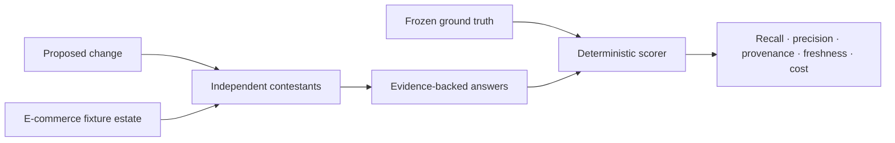

# Cross-Repository Change-Impact POC

An evidence-driven experiment for answering a difficult engineering question:

> When a change starts in one repository, which other repositories, contracts,
> symbols, and tests are actually affected—and how do we know the answer is
> complete?

The e-commerce system in this repository is the **fixture estate**, not the
research goal. Its REST APIs, Kafka events, database schemas, caches, shared
business values, and browser client create realistic dependencies for comparing
change-impact approaches.

[Study documentation](https://kesari.github.io/ecommerce-poc/) ·
[Experiment design](https://kesari.github.io/ecommerce-poc/architecture.html) ·
[Run the study](https://kesari.github.io/ecommerce-poc/running-locally.html) ·
[Corpus and scoring](https://kesari.github.io/ecommerce-poc/contracts.html)

## Primary decision

Determine whether a maintained code/system graph adds enough incremental
cross-repository recall and evidence quality to justify its operational cost
over compiler indexing plus agent-driven retrieval.

The working thesis is:

> **Retrieval finds relevant knowledge. Graphs encode dependency topology.
> Compilers establish deterministic truth. Agents reason across all three.**

The experiment optimizes for low false-negative rates. Missing one critical
runtime consumer is worse than returning several evidence-backed false
positives.

## Contestants

| Contestant | What it tests |
|---|---|
| Agent-only | Dynamic search and semantic reasoning with repository-native tools |
| Hybrid retrieval | Agent reasoning augmented by lexical and semantic retrieval |
| SCIP | Compiler-derived symbol identity, definitions, and references |
| Gortex | Cross-service REST, event, schema, and blast-radius topology |
| Graphify | A lighter persistent structural and semantic graph |
| Combined | Retrieval, compiler truth, system topology, and agent reasoning together |

The harness currently has executable Claude and Codex agent-only runners. Its
answer schema and scorer support all six contestants, and worked answers
demonstrate agent-only and Gortex scoring. Adding the remaining integrations is
part of the POC rather than a completed claim.

## Experiment model



Every scenario freezes ground truth before contestants run. An answer identifies
affected repositories, symbols, contracts, and tests, with an evidence tier for
each finding:

| Evidence tier | Meaning |
|---|---|
| `compiler` | Compiler/indexer truth; very high confidence |
| `extracted` | Direct structural evidence from code or configuration |
| `contract_matched` | Provider/consumer relationship matched through a contract |
| `inferred` | Semantic inference requiring review |
| `hypothesis` | Lead to investigate, not established impact |

The weighted score emphasizes cross-repository recall (35%) and contract recall
(20%), followed by precision, evidence quality, freshness, latency, and
operational cost. Critical misses are also reported independently so a composite
score cannot hide them.

## Worked discriminator: REST-001

The current frozen record asks:

> What breaks if Account renames address JSON field `postalCode` to
> `postcode`?

The direct provider is Account, but the actual blast radius crosses repository
and contract boundaries:

```text
account-service
  └─ Address JSON response
       ├─ commerce-web consumes the field
       └─ order-service binds it by name
            └─ order.confirmed.v1 carries the now-null value
                 └─ shipment-service rejects it and routes the event to its DLQ
```

The Shipment dependency is value-level and transitive: contract-key matching
alone misses it. The pass-through BFF contains no typed field reference and is
correctly excluded. This separates topology-aware analysis from simple grep.

## Repository map

```text
ecommerce-poc/
├── impact-study/             experiment definition, research, corpus, and harness
│   ├── docs/
│   └── harness/
├── account-service/          fixture repositories
├── basket-service/
├── catalog-service/
├── inventory-service/
├── order-service/
├── payment-service/
├── shipment-service/
├── commerce-bff/
├── commerce-web/
├── commerce-platform/        local infrastructure and end-to-end scenarios
└── docs/                     published GitHub Pages site
```

The fixture repositories retain their original histories in this assembled
repository, allowing contestants to use source, contracts, tests, configuration,
and history as evidence.

## Run the harness

The scorer uses only the Python standard library:

```bash
cd impact-study/harness
python3 -m unittest discover -s scoring -p 'test*.py'

python3 scoring/score.py score \
  --ground-truth records/REST-001.json \
  --answer answers/examples/REST-001-agent-only.json

python3 scoring/score.py marginal \
  --ground-truth records/REST-001.json \
  --baseline answers/examples/REST-001-agent-only.json \
  --candidate answers/examples/REST-001-gortex.json
```

See the
[architectural proposal](impact-study/docs/architecture/cross-repo-change-impact-architectural-poc-proposal.md)
for hypotheses, decision gates, and the target 30-record corpus.

## Run the fixture estate

Docker Compose starts the React storefront, BFF, domain services, PostgreSQL,
Kafka, Valkey, and observability stack:

```bash
docker compose -f commerce-platform/compose.yaml up --build -d
```

- Storefront: `http://localhost:3000`
- BFF Swagger UI: `http://localhost:8080/swagger-ui.html`
- Jaeger: `http://localhost:16686`
- Prometheus: `http://localhost:9090`

The Compose credentials and JWT secret are local fixtures only.

## Current scope

Implemented:

- realistic Java 21/Spring Boot and React fixture estate;
- REST, OpenAPI, Kafka, AsyncAPI, Flyway, MyBatis, Valkey, and circuit-breaker surfaces;
- frozen-record-first JSON schemas and deterministic scorer;
- miss severity, evidence provenance, marginal-value comparison, aggregation,
  blind agent runner, and example answers;
- CI for all fixture services and the web application.

Still required for the full study:

- expand the corpus from the worked record to the planned 30 changes, including
  shared-library, database-schema, and less-greppable scenarios;
- integrate and run hybrid retrieval, SCIP, Gortex, Graphify, and the combined stack;
- execute fresh-change overlays and collect latency and operational-cost data;
- apply the decision gates and publish the architecture recommendation.
