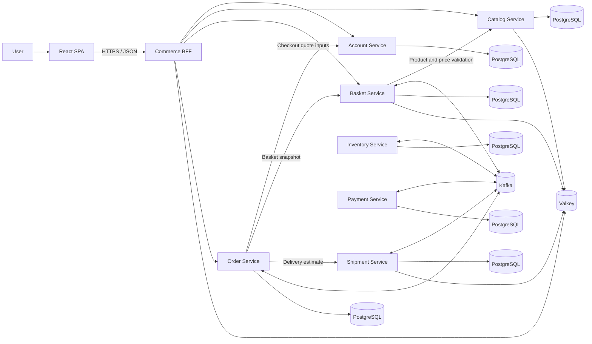
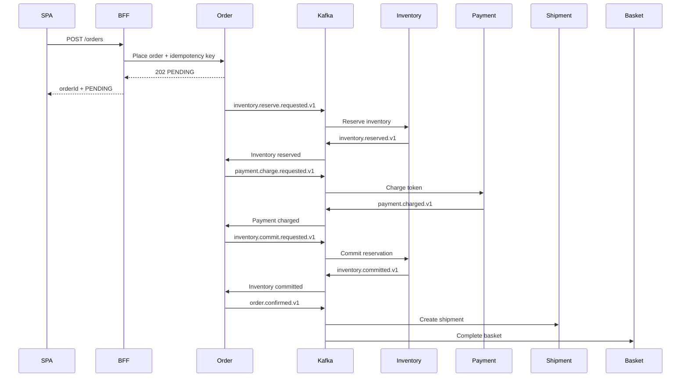

# E-commerce Microservices POC Design

**Status:** Proposed baseline  
**Purpose:** Provide a small but realistic cross-repository microservice system for change-impact analysis  
**Primary stack:** React, Java 21, Spring Boot 3.5.x, MyBatis, Kafka, PostgreSQL, Valkey  

---

## 1. Executive Summary

This proof of concept implements a deliberately small e-commerce checkout journey:

1. A user signs up and logs in.
2. The user browses products and adds them to a basket.
3. The user may apply one coupon to the basket.
4. The user selects a saved address or adds a new address.
5. The system presents an estimated price and delivery date.
6. The user pays by credit card and places the order.
7. The user observes the order progress until it is confirmed or rejected.

The design is **asynchronous where asynchronous processing improves resilience or decoupling**, but not asynchronous merely for its own sake. Operations where the user needs an immediate answer use synchronous HTTP. Order fulfilment uses a Kafka-based, orchestrated saga.

Each service owns its data. PostgreSQL is the authoritative data store, and Valkey is used only for caching and other explicitly temporary data. No service reads another service's database or cache entries.

The POC intentionally includes multiple forms of cross-repository dependency:

- React-to-BFF API dependencies
- Synchronous REST dependencies between services
- Asynchronous Kafka command and event dependencies
- OpenAPI and AsyncAPI/schema dependencies
- Data-shape and business-rule dependencies

These relationships provide a controlled system on which cross-repository change-impact techniques can be evaluated.

---

## 2. Goals

- Implement the complete user journey described above.
- Keep the domain and infrastructure understandable to one developer.
- Use realistic microservice boundaries and separate repositories.
- Demonstrate synchronous and asynchronous service relationships.
- Demonstrate eventual consistency and compensation after failures.
- Provide deterministic change-impact benchmark scenarios.
- Run locally with a single platform command.
- Make service interactions observable through logs, traces, metrics, and Kafka metadata.

## 3. Non-Goals

- Production-scale traffic or multi-region deployment
- Kubernetes deployment or batch workload scheduling
- Multiple payment methods
- Real credit-card processing or storage of card details
- Returns, refunds initiated by users, exchanges, or cancellations
- Warehouses, split shipments, or sophisticated routing
- Multiple currencies
- Tax-provider integration
- Coupon stacking or complex promotion campaigns
- Search, recommendations, reviews, wish lists, or notifications
- Administrative user interfaces
- A universal shared DTO library used by every service
- JPA/Hibernate or ORM-managed entity graphs

---

## 4. Architecture Principles

### 4.1 Clear data ownership

Every business entity has one authoritative owner. Other services interact with that owner through HTTP or Kafka contracts.

### 4.2 Synchronous for immediate decisions

Login, basket changes, address management, checkout preview, and status retrieval return immediate HTTP responses.

### 4.3 Asynchronous for the order saga

Inventory reservation, payment, inventory commit, shipment creation, and basket completion are coordinated through Kafka.

### 4.4 At-least-once delivery

Kafka consumers assume messages may be delivered more than once. Every state-changing consumer is idempotent.

### 4.5 Database and event atomicity

Services use the transactional outbox pattern when persisting state and publishing an event as one logical operation.

### 4.6 Cache is never the source of truth

Valkey improves read performance. PostgreSQL remains authoritative for business data.

### 4.7 Contracts are explicit

Synchronous interfaces are documented with OpenAPI. Kafka interfaces are documented with AsyncAPI and versioned JSON schemas.

### 4.8 Data-oriented Java

Services use stable Java 21 language features without enabling preview features:

- Records model immutable values, commands, events, API contracts, query results, and snapshots.
- Sealed interfaces model closed sets of outcomes and states.
- Exhaustive pattern switches implement explicit state transitions.
- MyBatis maps SQL results into immutable records through constructor mapping.
- MapStruct may generate repetitive structural mappings between boundary records.
- Persistence rows, domain values, and transport contracts remain separate types even when their shapes are similar.

### 4.9 Fail fast at synchronous boundaries

Every synchronous service-to-service HTTP client uses an explicit connection timeout, response timeout, and circuit breaker. A circuit breaker is isolated per caller and downstream service so one unavailable dependency does not exhaust request threads or prevent calls to healthy dependencies.

Circuit breakers protect synchronous HTTP calls only. Kafka consumers use bounded retries, retry topics, dead-letter topics, and idempotent handlers instead.

---

## 5. System Context



The diagram shows logical data ownership. The local environment may run one PostgreSQL server with a separate database and credential for each service.

---

## 6. Component Responsibilities

### 6.1 React SPA

Responsibilities:

- Signup and login screens
- Product browsing
- Basket management
- Coupon application and removal
- Saved-address selection and new-address entry
- Checkout preview
- Credit-card test-token selection or entry through a mock payment form
- Order submission and status display

The SPA communicates only with the BFF. It never calls domain services directly.

### 6.2 Commerce BFF

Responsibilities:

- Provide an API tailored to the SPA
- Validate authentication tokens
- Forward identity and correlation metadata
- Compose simple frontend responses where appropriate
- Translate internal failures into stable frontend error responses
- Optionally cache anonymous catalog responses
- Expose order-status polling to the SPA

The BFF must not own basket, order, pricing, payment, or inventory rules.

### 6.3 Account Service

Owns:

- User account
- Password hash
- Refresh-token metadata
- Saved delivery addresses

Responsibilities:

- Register users
- Authenticate users
- Issue and refresh JWTs
- Create, list, update, and delete addresses
- Confirm that an address belongs to the authenticated user

### 6.4 Catalog Service

Owns:

- Product identity
- Product name and description
- Image URL
- Current unit price
- Product active/inactive status

Catalog does not own stock quantities.

### 6.5 Basket Service

Owns:

- One active basket per user
- Basket items and quantities
- Applied coupon
- Basket version
- Basket lifecycle state

Responsibilities:

- Add, update, and remove products
- Apply or remove one coupon
- Reject a second coupon while one is active
- Calculate the basket price breakdown
- Supply a versioned basket snapshot for checkout
- Mark a basket as checked out after order confirmation

For the POC, coupon definitions and validation rules live in Basket. A separate Promotion service is intentionally excluded.

### 6.6 Inventory Service

Owns:

- Available quantity per product
- Inventory reservations
- Reservation state and expiry

Responsibilities:

- Reserve all requested items atomically at the business-operation level
- Reject a reservation when any requested item lacks stock
- Commit a valid reservation
- Release a reservation during compensation
- Deduplicate repeated commands

### 6.7 Order Service

Owns:

- Checkout quotes
- Orders and order lines
- Address, product, price, coupon, and delivery snapshots
- Order saga state
- Order status history

Responsibilities:

- Generate checkout quotes
- Validate quote expiry and basket version
- Accept idempotent place-order requests
- Orchestrate inventory, payment, and compensation through Kafka
- Publish the final order outcome
- Expose current order status

### 6.8 Payment Service

Owns:

- Payment attempts
- Payment state
- Mock provider references
- Refund/compensation records

Responsibilities:

- Accept only the `CREDIT_CARD` payment method
- Process test payment tokens
- Emit charged or declined results
- Process idempotent refund commands

The service never stores a raw card number, expiry date, or CVV.

### 6.9 Shipment Service

Owns:

- Delivery-estimate rules
- Shipment records
- Promised delivery window
- Shipment status

Responsibilities:

- Calculate a delivery estimate for a basket and address
- Create a shipment after order confirmation
- Publish shipment creation and delivery-status changes

---

## 7. Data Ownership

| Data | Authoritative owner | Cache allowed |
|---|---|---:|
| Users and credentials | Account | No credential caching |
| Saved addresses | Account | No for initial POC |
| Product details and prices | Catalog | Yes |
| Stock and reservations | Inventory | No authoritative cache |
| Active basket and coupon | Basket | Yes |
| Checkout quote | Order | No |
| Order and order status | Order | No |
| Payment attempt | Payment | No |
| Delivery estimate | Shipment | Yes |
| Shipment | Shipment | No |

Services must not share tables, database credentials, JPA entities, or Valkey keys.

---

## 8. Primary User Workflows

### 8.1 Signup and login

1. SPA submits credentials to the BFF.
2. BFF calls Account.
3. Account validates the request or password.
4. Account returns an access token and refresh token.
5. The SPA uses the access token for subsequent requests.

Signup and login are synchronous.

### 8.2 Add a product to the basket

1. SPA sends a product and quantity to the BFF.
2. BFF calls Basket.
3. Basket verifies that the product is active and obtains its current price from Catalog.
4. Basket records the item and increments `basketVersion`.
5. Basket returns the updated price breakdown.

Adding a product does not reserve stock. A lightweight availability indication may be shown, but Inventory remains authoritative during order placement.

### 8.3 Apply a coupon

1. SPA sends a coupon code to the BFF.
2. BFF calls Basket.
3. Basket rejects the request if another coupon is already applied.
4. Basket validates the coupon and recalculates the price.
5. Basket increments `basketVersion` and returns the updated basket.

### 8.4 Select or add an address

1. SPA retrieves saved addresses through the BFF.
2. The user selects one address, or creates a new address through Account.
3. The selected `addressId` is sent when requesting a checkout quote.

The Order service stores an immutable address snapshot in the quote and eventual order. A later Account change must not rewrite order history.

### 8.5 Generate checkout preview

1. SPA requests a checkout preview with `basketId` and `addressId`.
2. BFF calls Order to create a quote.
3. Order retrieves the versioned basket snapshot. Basket refreshes current Catalog prices and reapplies its coupon rule before returning the snapshot; a price change increments `basketVersion`.
4. Order retrieves and validates the selected address.
5. Order requests a delivery estimate and shipping charge from Shipment.
6. Order composes Basket subtotal, discount, tax, and Shipment charge, then persists an immutable quote with a short expiry.
7. The quote is returned through the BFF.

Example response:

```json
{
  "quoteId": "9bfd9d49-67a7-41f4-9476-5c5131ea43b2",
  "expiresAt": "2026-08-23T12:10:00Z",
  "basketVersion": 7,
  "price": {
    "subtotalMinor": 250000,
    "discountMinor": 25000,
    "shippingMinor": 10000,
    "taxMinor": 40500,
    "totalMinor": 275500,
    "currency": "INR"
  },
  "estimatedDelivery": {
    "from": "2026-08-25",
    "to": "2026-08-26"
  }
}
```

Money is represented as integer minor units plus an ISO currency code. The POC supports only `INR`.

A quote is an estimate and not an inventory reservation. It should expire after ten minutes. Order placement can still be rejected if inventory is no longer available.

### 8.6 Place an order

1. SPA submits `quoteId`, `paymentMethod`, and a mock payment token.
2. BFF calls Order with an `Idempotency-Key`.
3. Order validates user ownership, quote expiry, basket version, and payment method.
4. Order persists a `PENDING` order and an outbox command.
5. Order returns `202 Accepted` with `orderId`.
6. Kafka drives the remaining saga.
7. SPA polls the order-status endpoint until a terminal or user-meaningful state is reached.

---

## 9. Checkout and Order APIs

The following endpoints define the initial external shape. Detailed schemas belong in each repository's OpenAPI document.

### BFF-facing endpoints

```text
POST   /api/v1/auth/signup
POST   /api/v1/auth/login
POST   /api/v1/auth/refresh

GET    /api/v1/products
GET    /api/v1/products/{productId}

GET    /api/v1/basket
POST   /api/v1/basket/items
PATCH  /api/v1/basket/items/{productId}
DELETE /api/v1/basket/items/{productId}
PUT    /api/v1/basket/coupon
DELETE /api/v1/basket/coupon

GET    /api/v1/addresses
POST   /api/v1/addresses
PUT    /api/v1/addresses/{addressId}
DELETE /api/v1/addresses/{addressId}

POST   /api/v1/checkout/quotes
POST   /api/v1/orders
GET    /api/v1/orders/{orderId}
```

### Place-order request

```json
{
  "quoteId": "9bfd9d49-67a7-41f4-9476-5c5131ea43b2",
  "payment": {
    "method": "CREDIT_CARD",
    "token": "tok_success"
  }
}
```

The request must include an `Idempotency-Key` header. Reusing the key with the same request returns the original result; reusing it with different content returns a conflict.

### Place-order response

```http
HTTP/1.1 202 Accepted
Location: /api/v1/orders/a33f31d7-6d64-4476-a70f-9fca42a5308f
```

```json
{
  "orderId": "a33f31d7-6d64-4476-a70f-9fca42a5308f",
  "status": "PENDING"
}
```

---

## 10. Asynchronous Order Saga

Order is the saga orchestrator. It decides the next step after consuming each result event.



### 10.1 Success path

```text
PENDING
  -> INVENTORY_RESERVATION_PENDING
  -> INVENTORY_RESERVED
  -> PAYMENT_PENDING
  -> PAYMENT_CHARGED
  -> INVENTORY_COMMIT_PENDING
  -> CONFIRMED
```

### 10.2 Inventory rejection

```text
PENDING
  -> INVENTORY_RESERVATION_PENDING
  -> REJECTED_OUT_OF_STOCK
```

Payment is never requested.

### 10.3 Payment decline

```text
INVENTORY_RESERVED
  -> PAYMENT_PENDING
  -> PAYMENT_FAILED
  -> INVENTORY_RELEASE_PENDING
  -> REJECTED_PAYMENT
```

### 10.4 Inventory commit failure after payment

This is an exceptional compensation path:

```text
PAYMENT_CHARGED
  -> INVENTORY_COMMIT_PENDING
  -> INVENTORY_COMMIT_FAILED
  -> COMPENSATION_PENDING
  -> PAYMENT_REFUND_PENDING
  -> CANCELLED
```

Inventory reports the domain failure through `inventory.commit-failed.v1`.
Processing exceptions continue through retry topics and the DLQ rather than
being misreported as a domain outcome.

The Order service records every state transition so failures are explainable.

---

## 11. Kafka Contracts

### 11.1 Topics

```text
inventory.reserve.requested.v1
inventory.reserved.v1
inventory.reservation-rejected.v1
inventory.commit.requested.v1
inventory.committed.v1
inventory.commit-failed.v1
inventory.release.requested.v1
inventory.released.v1

payment.charge.requested.v1
payment.charged.v1
payment.declined.v1
payment.refund.requested.v1
payment.refunded.v1

order.confirmed.v1
order.cancelled.v1

shipment.created.v1
shipment.delivery-updated.v1
```

Retry topics and dead-letter topics follow a consistent suffix convention:

```text
<topic>.retry.1
<topic>.retry.2
<topic>.dlq
```

### 11.2 Event envelope

```json
{
  "eventId": "d7b3a7d1-8c59-4bf3-95fb-312f94f54b10",
  "eventType": "inventory.reserved",
  "schemaVersion": 1,
  "occurredAt": "2026-08-23T12:02:31.442Z",
  "producer": "inventory-service",
  "correlationId": "a33f31d7-6d64-4476-a70f-9fca42a5308f",
  "causationId": "4370e4eb-0f12-4939-b470-3aa8a67ee7aa",
  "partitionKey": "a33f31d7-6d64-4476-a70f-9fca42a5308f",
  "payload": {}
}
```

All order-saga identifiers use canonical UUID strings. Messages use `orderId`
as the Kafka partition key, preserving order within an order's event stream.

### 11.3 Delivery guarantees

- Producers write domain state and an outbox row in one PostgreSQL transaction.
- An outbox publisher sends unpublished rows to Kafka.
- Consumers store processed `eventId` values in an inbox table.
- Duplicate events return the previously established outcome without repeating the business operation.
- Events are acknowledged only after the local transaction commits.
- Exhausted retries go to a dead-letter topic with the original event and error metadata.
- Operational tooling may replay a dead-letter message manually; automatic infinite replay is prohibited.

The system provides at-least-once delivery with idempotent processing. It does not claim distributed exactly-once semantics.

---

## 12. Valkey Caching Design

PostgreSQL remains the source of truth. The initial POC uses one Valkey instance with isolated service prefixes and credentials where practical.

| Service | Cached value | Example key | TTL |
|---|---|---|---:|
| Catalog | Product details | `catalog:product:{productId}` | 10 minutes |
| Catalog | Product list page | `catalog:list:{queryHash}` | 2 minutes |
| Basket | Active basket snapshot | `basket:user:{userId}` | 20 minutes |
| Shipment | Delivery estimate | `shipment:estimate:{requestSha256}` | 5 minutes |
| BFF | Anonymous catalog response | `bff:catalog:{queryHash}` | 1 minute |

The default pattern is cache-aside:

```text
Request
  -> read Valkey
      -> hit: return value
      -> miss: read PostgreSQL, cache value, return value
```

Rules:

- A write updates PostgreSQL before invalidating the related cache entry.
- Cache unavailability degrades performance, not correctness.
- Checkout quotes never depend on a stale cached total.
- Inventory availability, order state, payment state, and shipment state are not authoritative in Valkey.
- Services never read another service's cache namespace.
- Sensitive credentials and raw payment data are never cached.

For the POC, direct invalidation after a successful service-owned write is sufficient. Kafka-driven cross-service cache invalidation may be added only where a real consumer requires it.

---

## 13. MyBatis Persistence Design

MyBatis is the service persistence abstraction. Services do not use JPA/Hibernate or call Spring `JdbcTemplate`/`JdbcClient` directly. MyBatis continues to use the configured JDBC `DataSource` and Spring-managed transactions underneath.

### 13.1 Persistence structure

Each service keeps persistence concerns behind repository interfaces:

```text
domain/
  model/                 # Records, sealed outcomes, value objects
  service/               # Business operations and state transitions

application/
  port/                  # Repository interfaces used by the domain/application
  mapping/               # Optional MapStruct boundary mappers

infrastructure/
  persistence/
    mapper/              # MyBatis mapper interfaces
    row/                 # Database row records
    repository/          # Repository adapter implementations

resources/
  mybatis/
    mapper/              # Mapper XML and explicit SQL
```

The domain does not depend on MyBatis annotations or SQL types.

### 13.2 Mapping conventions

- Query results map into immutable row records through their canonical constructors.
- Explicit `resultMap` definitions are used when a query has joins, aliases, nested results, or non-trivial conversions.
- SQL column aliases match record component names for simple automatic mappings.
- The Java compiler retains parameter names with `-parameters`.
- `mapUnderscoreToCamelCase` is enabled for conventional snake-case columns.
- Unknown automatically mapped columns fail fast in development and tests.
- Custom `TypeHandler` implementations are limited to well-defined values such as IDs, enums, JSONB, and timestamps.
- Application-generated order, basket, payment, reservation, and event IDs avoid mutating immutable records after insert.

### 13.3 SQL conventions

- Mapper XML is the default for multi-line or dynamic SQL.
- Mapper annotations are limited to genuinely trivial statements.
- Every query names columns explicitly; production queries do not use `SELECT *`.
- Updates that enforce optimistic locking include the current version in the `WHERE` clause.
- Repository adapters verify affected-row counts and translate conflicts into domain outcomes.
- Pagination and ordering are explicit and deterministic.
- PostgreSQL-specific SQL is acceptable because database portability is not a POC goal.

### 13.4 Transactions and events

- Spring `@Transactional` defines service-level transaction boundaries.
- A business change and its outbox row are written in the same transaction.
- Kafka publication never occurs inside a database transaction as a substitute for the outbox.
- Consumer inbox insertion and business-state mutation occur in one transaction.
- Mapper interfaces are not called directly by controllers or Kafka listeners; application services own the transaction and business operation.

### 13.5 Caching

MyBatis second-level caching is disabled. Valkey is the explicit application cache, with service-owned keys, TTLs, invalidation rules, and metrics. This prevents two independent cache layers from producing unclear consistency behavior.

### 13.6 MapStruct usage

MapStruct is optional and used only when a structural conversion would otherwise require repetitive field-copying code.

Appropriate uses:

- MyBatis row record to domain record
- Domain record to HTTP response record
- Kafka payload record to an application command
- Lists of otherwise straightforward mappings

Inappropriate uses:

- Pricing or coupon calculations
- Order state transitions
- Inventory availability decisions
- Payment outcome handling
- Validation or defaulting that represents a business rule
- Mapping that must call a domain factory to preserve an invariant

Small mappings remain explicit constructor or factory calls. Generated mapping must not obscure business decisions.

Each service owns a local `@MapperConfig` with these defaults:

```java
@MapperConfig(
        componentModel = MappingConstants.ComponentModel.SPRING,
        injectionStrategy = InjectionStrategy.CONSTRUCTOR,
        unmappedTargetPolicy = ReportingPolicy.ERROR,
        typeConversionPolicy = ReportingPolicy.ERROR
)
public interface ServiceMappingConfig {
}
```

Rules:

- A missing target field fails compilation.
- Lossy implicit type conversions fail compilation.
- Semantically different fields require an explicit `@Mapping` declaration.
- Mapper configuration is service-local and is not distributed as a universal shared library.
- Generated sources are included in compilation and static analysis but are not committed.
- The latest stable MapStruct version supported by the Java 21 build is pinned during scaffolding; preview or beta releases are not adopted without a demonstrated need.

---

## 14. Consistency, Concurrency, and Idempotency

### Basket concurrency

- Every basket contains a numeric `basketVersion`.
- Mutating operations use optimistic locking.
- Checkout quotes record the basket version used to calculate them.
- Order placement rejects a quote when the active basket version has changed.

### Inventory concurrency

- Stock mutation occurs inside a database transaction.
- Reservations have unique IDs and an expiry timestamp.
- Repeated reserve, commit, or release commands are idempotent.
- Available stock cannot become negative.

### Order idempotency

- `POST /orders` requires an `Idempotency-Key`.
- Order stores the key, authenticated user, request hash, order ID, and original response.
- An identical retry returns the original order.
- A key reused with a different request is rejected.

### Payment idempotency

- Payment uses `orderId` plus operation type as its provider idempotency reference.
- A duplicated charge command cannot create a second charge.
- A duplicated refund command cannot create a second refund.

---

## 15. Security and Payment Boundaries

- Passwords are stored using an adaptive password hash supported by Spring Security.
- Access tokens are short-lived JWTs.
- Refresh tokens are rotated and revocable.
- The BFF validates authentication and forwards trusted identity metadata.
- Domain services still enforce resource ownership; they do not trust client-supplied user IDs.
- Address access is scoped to the authenticated user.
- Logs and events exclude passwords, real provider tokens, raw card data, and
  other secrets. The three fixed mock payment selectors are non-secret POC test
  controls and are redacted from logs even though the asynchronous charge
  command carries one.
- APIs validate request sizes and field formats.
- Login and signup endpoints are rate-limited using temporary Valkey counters.

The POC payment form produces predefined tokens:

```text
tok_success
tok_declined
tok_error
```

Only `CREDIT_CARD` is accepted as a payment method. The POC does not enter PCI scope by implementing or storing actual card details.

---

## 16. Error Model

HTTP services use a consistent problem response based on RFC 9457 semantics:

```json
{
  "type": "https://poc.example/problems/quote-expired",
  "title": "Checkout quote expired",
  "status": 409,
  "code": "QUOTE_EXPIRED",
  "detail": "Create a new checkout quote before placing the order.",
  "correlationId": "9160033c-5288-46d7-ab7a-ad231b69e17d"
}
```

Stable machine-readable codes are part of the API contract. Internal stack traces are never returned to the SPA.

Expected domain errors include:

```text
EMAIL_ALREADY_REGISTERED
INVALID_CREDENTIALS
PRODUCT_NOT_FOUND
PRODUCT_INACTIVE
BASKET_VERSION_CONFLICT
COUPON_ALREADY_APPLIED
COUPON_INVALID
ADDRESS_NOT_FOUND
QUOTE_EXPIRED
QUOTE_BASKET_CHANGED
OUT_OF_STOCK
PAYMENT_DECLINED
ORDER_NOT_FOUND
```

---

## 17. Synchronous HTTP Resilience

Circuit breakers apply to all synchronous service boundaries:

- BFF to Account, Catalog, Basket, and Order
- Basket to Catalog
- Order to Account, Basket, and Shipment

Each caller maintains a separate Resilience4j circuit-breaker instance for each downstream service. Calls use explicit HTTP client timeouts in addition to the breaker; a circuit breaker does not cancel a slow request by itself.

### 17.1 Default POC policy

| Setting | Default |
|---|---:|
| Connection timeout | 500 ms |
| Overall downstream call budget | 2 seconds, including any retry |
| Sliding window | Last 20 calls, count based |
| Minimum calls before evaluation | 10 |
| Failure-rate threshold | 50% |
| Slow-call threshold | 1.5 seconds |
| Slow-call-rate threshold | 50% |
| Open-state wait duration | 10 seconds |
| Calls permitted in half-open state | 3 |

Connection failures, timeouts, HTTP `5xx` responses, and HTTP `429` responses count as breaker failures. Expected domain and validation responses in the `4xx` range do not count as breaker failures.

These values are POC defaults, not universal production values. They are configured externally per client and may be tuned from measured latency and failure data without recompiling a service.

### 17.2 Retry and fallback rules

- State-changing HTTP requests are not retried automatically. Their existing idempotency controls protect user-initiated retries.
- Idempotent reads may make at most one retry with short jitter, and only for connection failures, timeouts, `429`, or `5xx` responses.
- The retry is composed inside the circuit breaker so one logical downstream operation contributes one final breaker outcome; all attempts must remain within the overall call budget.
- No fallback may fabricate authentication, basket, address, price, tax, delivery, or order data.
- A valid Catalog value already present in the normal cache may still be served according to its existing cache policy. An open circuit does not extend its TTL.
- Checkout-quote creation fails as a whole if Account, Basket, or Shipment is unavailable; partial quotes are prohibited.
- When no valid fallback exists, the caller returns RFC 9457 problem details with HTTP `503`, code `DOWNSTREAM_SERVICE_UNAVAILABLE`, a correlation ID, and an optional `Retry-After` header.
- Breaker state is local and temporary; PostgreSQL and Kafka remain authoritative for durable business state.

Readiness indicates whether the application can accept work and must not flap merely because one downstream circuit is open. Breaker state is exposed through restricted health details, metrics, logs, and traces.

---

## 18. Observability

Every HTTP request and Kafka message carries:

- `correlationId`
- W3C trace context
- Authenticated user ID where safe and relevant
- `orderId`, `basketId`, and `eventId` as structured fields when applicable

The local platform includes:

- Structured JSON application logs
- OpenTelemetry instrumentation
- Distributed traces across HTTP and Kafka
- Prometheus-compatible metrics
- Health and readiness endpoints
- Kafka consumer-lag visibility

Minimum business metrics:

```text
orders_created_total
orders_confirmed_total
orders_rejected_total{reason}
inventory_reservations_total{result}
payments_total{result}
order_saga_duration_seconds
kafka_consumer_failures_total{service,topic}
cache_requests_total{service,result}
resilience4j_circuitbreaker_calls_seconds_count{name,kind}
resilience4j_circuitbreaker_not_permitted_calls_total{name}
resilience4j_circuitbreaker_state{name,state}
```

---

## 19. Repository Structure

Each application is an independent Git repository beneath the POC workspace:

```text
POC-order-microservices/
├── commerce-web/
├── commerce-bff/
├── account-service/
├── catalog-service/
├── basket-service/
├── inventory-service/
├── order-service/
├── payment-service/
├── shipment-service/
└── commerce-platform/
```

### Service repository contents

```text
service-name/
├── src/
│   └── main/resources/mybatis/mapper/
├── openapi/
├── asyncapi/             # Only when the service produces or consumes Kafka
├── db/migration/
├── Dockerfile
├── pom.xml
├── mvnw
├── mvnw.cmd
├── .mvn/wrapper/
└── README.md
```

### Platform repository contents

```text
commerce-platform/
├── compose.yaml
├── kafka/
│   └── topic-definitions.yaml
├── postgres/
│   └── initialization/
├── observability/
├── scripts/
└── README.md
```

There is no shared database and no universal shared domain model. Producer-owned API and event schemas are the primary cross-repository contracts.

---

## 20. Technology Baseline

| Area | Choice |
|---|---|
| SPA | React and TypeScript |
| Backend | Java 21 and Spring Boot 3.5.x |
| Java language policy | Stable features only; preview disabled |
| Build | Maven Wrapper with Maven 3.9.x |
| HTTP | Spring MVC and JSON |
| Synchronous resilience | Resilience4j Spring Boot 3 starter, HTTP client timeouts, and Micrometer metrics |
| Authentication | Spring Security and JWT |
| Messaging | Apache Kafka in KRaft mode |
| Database | PostgreSQL |
| Persistence mapping | MyBatis Spring Boot Starter 3.0.x |
| Boundary object mapping | MapStruct where structural mapping is non-trivial |
| Cache | Valkey |
| Migrations | Flyway |
| API contracts | OpenAPI |
| Event contracts | AsyncAPI and JSON Schema |
| Testing | JUnit, Testcontainers, contract tests, React testing tools |
| Observability | OpenTelemetry and Prometheus-compatible metrics |
| Local runtime | Docker Compose |

Exact dependency versions are pinned when repositories are scaffolded. The initial fixture baseline uses Spring Boot 3.5.16. Because it is the final open-source release in the 3.5.x line, the fixture remains intentionally pinned rather than silently following framework upgrades.

---

## 21. Testing Strategy

### Unit tests

- Basket coupon and pricing rules
- Quote expiry and basket-version validation
- Order state transitions
- Inventory reservation and release rules
- Payment token outcomes
- Delivery-estimate rules

### Component tests

- Each service with PostgreSQL and Valkey where applicable
- MyBatis mapper tests against real PostgreSQL using Testcontainers
- Record constructor mappings, custom type handlers, optimistic updates, and affected-row handling
- MapStruct compile-time coverage plus focused tests for mappings with semantic conversions
- Kafka producers and consumers using Testcontainers
- Outbox publication and inbox deduplication
- OpenAPI request and response validation
- JSON schema validation for Kafka events
- Circuit-breaker closed, open, and half-open transitions using deterministic failure injection
- Confirmation that domain `4xx` responses do not open a circuit and dependency failures map to the stable `503` problem response

### Contract tests

- BFF against Account, Catalog, Basket, and Order contracts
- Order against Account, Basket, and Shipment contracts
- Kafka producer schemas against every consumer expectation

### End-to-end scenarios

1. Successful signup-to-confirmed-order journey
2. Invalid coupon
3. Attempt to apply a second coupon
4. Quote expires before order placement
5. Basket changes after quote creation
6. Insufficient inventory
7. Payment decline and inventory release
8. Duplicate place-order request
9. Duplicate Kafka delivery
10. Payment success followed by simulated inventory commit failure and refund
11. Valkey outage with correct database fallback
12. Consumer failure followed by retry and dead-letter handling
13. Synchronous dependency outage opens its circuit, fails fast with `503`, and recovers through half-open to closed

---

## 22. Cross-Repository Change-Impact Scenarios

The POC should establish a known expected blast radius for each seeded change.

| Change | Expected affected repositories | Dependency types |
|---|---|---|
| Rename address `postalCode` to `postcode` | Account, BFF, Order, Shipment, SPA | REST, JSON, code |
| Change money from minor units to decimal | Catalog, Basket, Order, Payment, BFF, SPA | REST, events, business semantics |
| Rename `basketVersion` | Basket, Order, BFF, SPA | REST and code |
| Change coupon discount representation | Basket, Order, BFF, SPA | REST and business rule |
| Rename `order.confirmed.v1` | Order, Shipment, Basket, platform | Kafka topology and AsyncAPI |
| Add an inventory rejection reason | Inventory, Order, BFF, SPA | Kafka schema and UI behavior |
| Change delivery window from dates to timestamp | Shipment, Order, BFF, SPA | REST and domain semantics |
| Rename a payment result enum | Payment, Order | Kafka schema and state machine |
| Change JWT subject interpretation | Account, BFF, all protected services | Security contract |
| Change Valkey basket key format | Basket only | Internal implementation |

These scenarios distinguish local implementation changes from changes that cross REST, Kafka, schema, and repository boundaries.

---

## 23. Delivery Plan

### Milestone 1: Platform and conventions

- Establish repository templates.
- Run PostgreSQL, Kafka, and Valkey with Docker Compose.
- Establish MyBatis mapper, row-record, repository-adapter, and transaction conventions.
- Define correlation, errors, event envelope, outbox, and inbox conventions.
- Establish shared circuit-breaker policy conventions without introducing a shared domain library.
- Add baseline observability.

### Milestone 2: Identity and catalog

- Implement Account and Catalog.
- Implement signup, login, address, and product APIs.
- Build the initial React and BFF flows.

### Milestone 3: Basket and inventory

- Implement Basket and Inventory.
- Add basket item and single-coupon behavior.
- Add Valkey cache-aside behavior.

### Milestone 4: Checkout preview

- Implement Shipment delivery estimates.
- Implement Order checkout quotes.
- Complete the address selection and price/delivery preview UI.

### Milestone 5: Asynchronous ordering

- Implement Payment mock.
- Implement the Kafka order saga.
- Add compensation, retry, dead-letter, and idempotency behavior.
- Complete order-status polling in the SPA.

### Milestone 6: Impact-analysis fixture

- Freeze a working baseline tag in every repository.
- Add contract and end-to-end tests.
- Introduce seeded changes one at a time on controlled branches.
- Record the expected repository and symbol-level blast radius.

---

## 24. Acceptance Criteria

The POC is complete when:

- A user can sign up and log in.
- A user can browse products and manage a basket.
- Only one coupon can be active in a basket.
- A user can select or add an address.
- Checkout shows an itemized estimated price and delivery window.
- Only credit-card test tokens are accepted.
- Order submission returns quickly with an order ID.
- Kafka asynchronously drives inventory, payment, and confirmation.
- Failure paths compensate inventory or payment correctly.
- The confirmed order creates a shipment and completes the basket.
- Duplicate HTTP requests and Kafka events do not duplicate business operations.
- PostgreSQL remains authoritative when Valkey is unavailable.
- Every synchronous downstream HTTP call has an explicit timeout and isolated circuit breaker.
- An unavailable synchronous dependency fails fast with the stable `DOWNSTREAM_SERVICE_UNAVAILABLE` response, and its circuit recovers through half-open state.
- Domain `4xx` responses do not contribute to circuit-breaker failure rates.
- Persistence uses tested MyBatis mappings into immutable records without JPA/Hibernate.
- OpenAPI and AsyncAPI contracts describe every cross-repository interface.
- Distributed traces connect the initial place-order request to saga events.
- Every seeded impact scenario has a documented expected blast radius.

---

## 25. Key Decisions

| Decision | Outcome |
|---|---|
| Java runtime | Java 21 LTS |
| Application framework | Spring Boot 3.5.x, initially pinned to 3.5.16 |
| Java language policy | Stable features only; preview disabled |
| Domain modeling | Records, sealed interfaces, and exhaustive pattern switches |
| Shopping container terminology | Basket |
| User-facing interaction style | Synchronous HTTP |
| Synchronous failure isolation | Resilience4j circuit breaker per caller and downstream service, with explicit HTTP timeouts |
| Order processing style | Kafka-based orchestrated saga |
| Order submission response | `202 Accepted` with polling |
| Payment methods | Credit card only, using mock tokens |
| Coupon ownership | Basket Service |
| Coupon stacking | Not allowed; one active coupon |
| Persistent store | PostgreSQL per service |
| Persistence mapping | MyBatis Spring Boot Starter 3.0.x; no JPA/Hibernate or direct Spring JDBC API usage |
| Boundary object mapping | MapStruct only for repetitive structural conversion |
| Cache | Valkey, never authoritative |
| Message guarantee | At-least-once with idempotency |
| Contract formats | OpenAPI and AsyncAPI/JSON Schema |
| Local runtime | Docker Compose |
| Batch processing | Excluded from the POC |
| Kubernetes and Kueue | Excluded from the POC |
